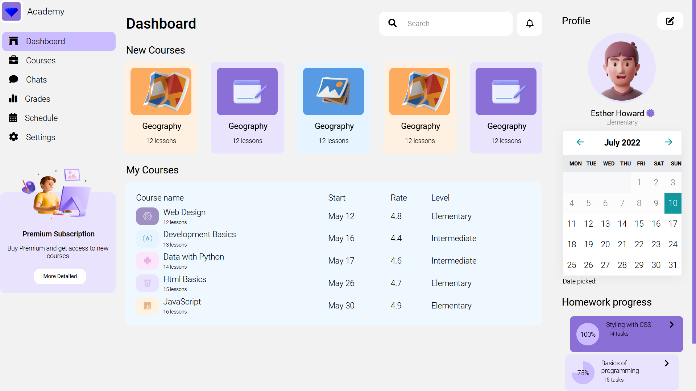

<!-- PROJECT LOGO -->
 

  

<h3 align="center">Frontend Mentorship Program</h3>

  

    with <a href="https://github.com/DanSalahi">Dan Salahi </a>!
     
    <a href="https://github.com/cenaei"><strong>More by me »</strong></a>
     
     
    <a href="https://github.com/cenaei">Final Project [soon]</a>
    ·
    <a href="https://github.com/cenaei/frontend-mentorship-challenge/issues">Report Bug</a>
    ·
    <a href="https://github.com/cenaei/frontend-mentorship-challenge/issues">Request Feature</a>
  

<!-- ABOUT THE PROJECT -->
## About The Project

 Academy Dashboard

* [Dribble](https://dribbble.com/shots/18289015-Study-Web-Dashboard)

(<a href="#top">back to top</a>)

### Built With
* [HTML](https://html.spec.whatwg.org/)
* [SASS](https://sass-lang.com/) 
* [JS](https://www.javascript.com/)
* [Swiper.JS](https://swiperjs.com/)
* [Vanilla Calendar](https://github.com/chrissy-dev/vanilla-calendar)

(<a href="#top">back to top</a>)

<!-- CONTACT -->
## Contact

Sina Sangiji - [Twitter](https://twitter.com/twitter_handle) - sina.sangiji@gmail.com

(<a href="#top">back to top</a>)

<!-- ACKNOWLEDGMENTS -->
## Acknowledgments

* [Build My Readme By](https://github.com/othneildrew/Best-README-Template)

(<a href="#top">back to top</a>)

